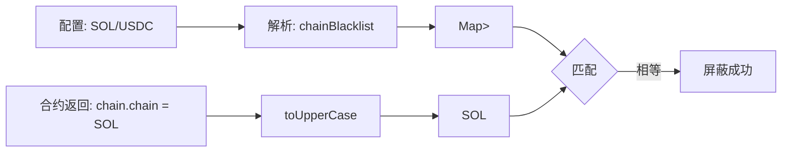

# Trade 充值黑名单/白名单过滤规则

## 架构概览

充值过滤系统通过 `depositList` 配置控制币种、链、充值方式的可见性和警告显示。

### 接口参数结构

```json
{
  "depositList": {
    "depositWhitelist": ["USDC", "BTC", "ETH", "MAG7.ssi", "sMAG7.ssi", "SOSO"],
    "depositBlacklist": ["ZEC", "SHIB", "BASE_ETH/USDC-regular"],
    "contractWarningList": ["BASE_ETH/ETH", "BSC_BNB/BNB"],
    "memoWarningList": ["XLM", "XRP"]
  },
  "depositTime": {
    "DEFAULT": 21,
    "BTC": 20,
    "ETH": 5,
    "BASE": 1
  }
}
```

### 数据流（从接口到 UI 显示）

```
页面加载 / 用户登录
    ↓
┌────────────────────────────────────────────────────────────────┐
│ 步骤 1: 接口获取黑名单配置                                        │
│ GET /biz/config/symbol                                         │
│ 返回 trade.coinBlacklist.depositList                            │
└───────────────────────┬────────────────────────────────────────┘
                        ↓
┌────────────────────────────────────────────────────────────────┐
│ 步骤 2: useFundingToken 解析配置                                 │
│ (useFundingToken.ts Line 156-160)                              │
│                                                                │
│ const depositList = trade?.coinBlacklist?.depositList;         │
│ const parsedDepositRules = useMemo(                            │
│   () => parseDepositRules(depositList),                        │
│   [depositList],                                               │
│ );                                                             │
└───────────────────────┬────────────────────────────────────────┘
                        ↓
┌────────────────────────────────────────────────────────────────┐
│ 步骤 3: injectDepositBalance 过滤代币列表                        │
│ (useFundingToken.ts Line 68-78)                                │
│                                                                │
│ const injectDepositBalance = async (                           │
│   tokenList: CoinInfo[],                                       │
│   owner: Address,                                              │
│   depositRules?: DepositFilterRules,                           │
│ ) => {                                                         │
│   const filteredTokens = depositRules                          │
│     ? filterTokensByRules(tokenList as CoinInfoData[], rules)  │
│     : (tokenList as CoinInfoData[]);                           │
│   // ... 注入余额                                               │
│ }                                                              │
└───────────────────────┬────────────────────────────────────────┘
                        ↓
┌────────────────────────────────────────────────────────────────┐
│ 步骤 4: 返回过滤后的 allCoins                                     │
│ (useFundingToken.ts Line 296-301)                              │
│                                                                │
│ return {                                                       │
│   query: {                                                     │
│     allCoins: tokenList,  // ← 已过滤的币种列表                  │
│   },                                                           │
│ };                                                             │
└───────────────────────┬────────────────────────────────────────┘
                        ↓
┌────────────────────────────────────────────────────────────────┐
│ 步骤 5: CoinSelector / ChainSelector 显示可选项                   │
│ 黑名单中的币种/链已被过滤，不会出现在下拉列表                        │
└───────────────────────┬────────────────────────────────────────┘
                        ↓
┌────────────────────────────────────────────────────────────────┐
│ 步骤 6: 用户选择链/币后检查警告                                    │
│ (DepositStepByStep.tsx Line 534-541)                           │
│                                                                │
│ const showContractWarning = useMemo(() => {                    │
│   if (!selectedChain?.chain || !selectedCoin?.coinSymbol)      │
│     return false;                                              │
│   const rules = parseDepositRules(                             │
│     trade.coinBlacklist?.depositList                           │
│   );                                                           │
│   return shouldShowWarning(                                    │
│     rules, selectedChain.chain, selectedCoin.coinSymbol        │
│   );                                                           │
│ }, [selectedChain, selectedCoin, trade.coinBlacklist]);        │
└───────────────────────┬────────────────────────────────────────┘
                        ↓
┌────────────────────────────────────────────────────────────────┐
│ 步骤 7: DepositAddressQR 显示警告 UI                              │
│ showContractWarning=true → 显示合约钱包警告                       │
│ showMemoWarning=true → 显示 Memo 警告                            │
└────────────────────────────────────────────────────────────────┘
```

---

## 参数规范

### 黑名单格式

| 格式 | 说明 | 示例 |
|------|------|------|
| `["LINK"]` | 整币种隐藏 | LINK 不显示 |
| `["BASE_ETH/USDC"]` | 链级隐藏 | USDC 的 Base 链隐藏 |
| `["BASE_ETH/USDC-regular"]` | Regular 方式隐藏 | USDC Base 链 Regular 不可用 |
| `["BASE_ETH/USDC-flash"]` | Flash 方式隐藏 | USDC Base 链 Flash 不可用 |

### 链名映射

| 合约返回（短格式） | 前端显示名称 | 说明 |
|-------------------|-------------|------|
| `BASE_ETH` | Base | 配置使用 |
| `ETH` | Ethereum | 配置使用 |
| `ARBITRUM_ETH` | Arbitrum | 配置使用 |
| `BSC_BNB` | BSC | 配置使用 |
| `SOL` | Solana | 配置使用 |
| `BTC` | Bitcoin | 配置使用 |
| `DOGE` | Dogecoin | 配置使用 |
| `XRP` | XRP Ledger | 配置使用 |
| `ADA` | Cardano | 配置使用 |
| `BNB` | BNB Chain | 配置使用 |

### 链名格式规范

**配置黑名单时必须使用合约返回的短格式链名**：

| 数据来源 | 链名格式 | 用途 | 示例 |
|---------|---------|------|------|
| **合约返回 `chain.chain`** | 短格式 | 黑名单配置、过滤匹配 | `SOL`, `ETH`, `BASE_ETH` |
| **前端 `formatChain()` 输出** | 显示名称 | UI 显示 | `Solana`, `Ethereum`, `Base` |

```json
{
  "depositBlacklist": [
    "SOL/USDC",         // ✅ 正确：使用合约返回的短格式链名
    "Solana/USDC"       // ❌ 错误：Solana 是显示名称，不会匹配
  ]
}
```

### 链名匹配流程



---

## 核心过滤流程

### parseBlacklistEntry 解析逻辑（完整代码）

```
(depositFilter.ts Line 49-103)

parseBlacklistEntry(entry, coinBlacklist, chainBlacklist, regularBlacklist, flashBlacklist)
    ↓
┌─────────────────────────────────────────────────────────────────┐
│ 1. 空值检查                                                      │
│    if (!entry?.trim()) return;  ← 防御性编程                     │
└──────┬──────────────────────────────────────────────────────────┘
       ↓
┌─────────────────────────────────────────────────────────────────┐
│ 2. 判断是否包含 "/"                                               │
│    if (!trimmed.includes("/"))                                  │
│        → coinBlacklist.add(trimmed.toUpperCase())               │
│        → return  ← 整币种黑名单                                   │
└──────┬──────────────────────────────────────────────────────────┘
       ↓ 包含 "/"
┌─────────────────────────────────────────────────────────────────┐
│ 3. 分割链和币                                                     │
│    const [chainPart, coinWithMethod] = trimmed.split("/");      │
│    const normalizedChain = chainPart?.trim().toUpperCase();     │
│                                                                 │
│    ⚠️ 异常格式处理 (Line 69-76):                                 │
│    if (!normalizedChain || !coinWithMethod?.trim()) {           │
│      const cleanedCoin = trimmed.replace(/\//g, "")...          │
│      coinBlacklist.add(cleanedCoin);  ← 容错：作为整币种处理      │
│    }                                                            │
└──────┬──────────────────────────────────────────────────────────┘
       ↓
┌─────────────────────────────────────────────────────────────────┐
│ 4. 检查方式后缀 (Line 79)                                         │
│    const methodMatch = coinWithMethod.match(                    │
│      /^(.+)-(regular|flash)$/i                                  │
│    );                                                           │
│                                                                 │
│    ├─ 有后缀 → regularBlacklist 或 flashBlacklist               │
│    │   targetMap.get(chain)!.add(coin)                          │
│    │                                                            │
│    └─ 无后缀 → chainBlacklist (链级黑名单)                        │
│        chainBlacklist.get(chain)!.add(coin)                     │
└─────────────────────────────────────────────────────────────────┘
```

### filterTokensByRules 过滤流程（完整代码）

```
(depositFilter.ts Line 204-286)

filterTokensByRules(tokens, rules)
    ↓
┌─────────────────────────────────────────────────────────────────┐
│ Step 1: 白名单过滤 (Line 224-227)                                 │
│                                                                 │
│ if (whitelist.size > 0 && !whitelist.has(normalizedSymbol)) {   │
│   return false;  ← 白名单非空时，只保留白名单中的币种              │
│ }                                                               │
│                                                                 │
│ 🔑 关键：whitelist 为空时跳过此步骤（不过滤任何币种）              │
└──────┬──────────────────────────────────────────────────────────┘
       ↓
┌─────────────────────────────────────────────────────────────────┐
│ Step 2: 整币种黑名单过滤 (Line 229-232)                           │
│                                                                 │
│ if (coinBlacklist.has(normalizedSymbol)) {                      │
│   return false;  ← 匹配则移除整个币种                            │
│ }                                                               │
└──────┬──────────────────────────────────────────────────────────┘
       ↓
┌─────────────────────────────────────────────────────────────────┐
│ Step 3: 链级黑名单过滤 (Line 239-247)                             │
│                                                                 │
│ const hasValidChain = token.chains.some((chain) => {            │
│   const chainKey = chain.chain?.toUpperCase();                  │
│   const chainBlockedCoins = chainBlacklist.get(chainKey);       │
│   return !chainBlockedCoins?.has(normalizedSymbol);             │
│ });                                                             │
│ return hasValidChain;  ← 所有链都被屏蔽则移除币种                 │
└──────┬──────────────────────────────────────────────────────────┘
       ↓
┌─────────────────────────────────────────────────────────────────┐
│ Step 4: Regular/Flash 方式过滤 (Line 265-281)                    │
│                                                                 │
│ .map((token) => {                                               │
│   const newChains = token.chains                                │
│     .filter(...)   ← 过滤被屏蔽的链                              │
│     .map((chain) => {                                           │
│       if (regularBlockedCoins?.has(normalizedSymbol) ||         │
│           flashBlockedCoins?.has(normalizedSymbol)) {           │
│         return {                                                │
│           ...chain,                                             │
│           enableRegular: regularBlockedCoins?.has(...) ? false  │
│             : chain.enableRegular,                              │
│           enableFlash: flashBlockedCoins?.has(...) ? false      │
│             : chain.enableFlash,                                │
│         };                                                      │
│       }                                                         │
│       return chain;  ← 纯函数，不修改原对象                      │
│     });                                                         │
│   return { ...token, chains: newChains };                       │
│ });                                                             │
└─────────────────────────────────────────────────────────────────┘
```

---

## 警告配置

### contractWarningList（合约钱包警告）

**格式**：`["BASE_ETH/ETH", "BSC_BNB/BNB"]` - 链/币组合

**触发条件**：用户选择的链/币组合在 `contractWarningList` 中

**显示位置**：`DepositAddressQR` 组件，二维码下方

**UI 元素**：
- 文案：`Standard wallet transfers only`
- 图标：`<Info />` from `@phosphor-icons/react`
- 颜色：`#FFC133`

**Tooltip 文案**：
> Send from a standard wallet address (EOA).
> Examples: MetaMask or an exchange withdrawal address.
> Transfers from smart contracts/contract wallets aren't supported.

### memoWarningList（Memo 警告）

**格式**：`["XLM", "XRP"]` - 只有币种名（币种级别，适用于该币种的所有链）

**触发条件**：用户选择的币种在 `memoWarningList` 中

**显示位置**：`DepositAddressQR` 组件，二维码下方

**UI 元素**：
- 文案：`Memo (If Required)`
- 图标：`<Info />` from `@phosphor-icons/react`
- 颜色：`#FFC133`

**Tooltip 文案**：
> If your exchange/wallet requires a memo for this deposit, enter any 9-digit number (e.g., 123456789). SoDEX does not require a memo.

### 格式差异对比

| 配置项 | 格式 | 匹配级别 | 示例 |
|--------|------|----------|------|
| `contractWarningList` | `链/币` | 链+币组合 | `BASE_ETH/ETH` |
| `memoWarningList` | `币` | 仅币种 | `XLM` |

---

## 核心函数

### parseDepositRules

```typescript
/**
 * 解析充值配置
 * @param depositList 充值配置列表
 * @returns 解析后的过滤规则
 */
export const parseDepositRules = (
  depositList?: API.Futures.CoinBlacklist.DepositList,
): DepositFilterRules
```

**返回类型**：

```typescript
interface DepositFilterRules {
  coinBlacklist: Set<string>;           // 整币种黑名单
  chainBlacklist: Map<string, Set<string>>;  // 链级黑名单
  regularBlacklist: Map<string, Set<string>>; // Regular 方式黑名单
  flashBlacklist: Map<string, Set<string>>;   // Flash 方式黑名单
  whitelist: Set<string>;               // 白名单
  warningList: Map<string, Set<string>>; // 合约警告列表
  memoWarningList: Set<string>;         // Memo 警告列表
}
```

### filterTokensByRules

```typescript
/**
 * 根据规则过滤代币列表
 * @param tokens 代币列表
 * @param rules 过滤规则
 * @returns 过滤后的代币列表
 */
export const filterTokensByRules = (
  tokens: CoinInfoData[],
  rules: DepositFilterRules,
): CoinInfoData[]
```

### shouldShowWarning

```typescript
/**
 * 检查指定链/币是否需要显示合约警告
 * @param rules 过滤规则
 * @param chain 链名
 * @param coinSymbol 币种符号
 * @returns 是否需要显示警告
 */
export const shouldShowWarning = (
  rules: DepositFilterRules,
  chain?: string,
  coinSymbol?: string,
): boolean
```

### shouldShowMemoWarning

```typescript
/**
 * 检查指定币种是否需要显示 Memo 警告
 * memoWarningList 是币种级别的，只需要匹配币种即可
 * @param rules 过滤规则
 * @param _chain 链名（未使用，保留参数兼容性）
 * @param coinSymbol 币种符号
 * @returns 是否需要显示 Memo 警告
 */
export const shouldShowMemoWarning = (
  rules: DepositFilterRules,
  _chain?: string,
  coinSymbol?: string,
): boolean
```

---

## 文件结构

```
src/pages/_components/
├── helper/
│   └── depositFilter.ts          # 核心过滤逻辑模块（326行）
├── hooks/
│   └── useFundingToken.ts        # 调用过滤模块，获取 allCoins
├── deposit/
│   ├── DepositStepByStep.tsx     # 主组件，计算 showContractWarning/showMemoWarning
│   └── _components/
│       └── DepositAddressQR.tsx  # 二维码区域，显示警告 UI

src/http/futures/
└── api.d.ts                      # DepositList 类型定义（L2470-2479）
```

---

## 术语表

| 术语 | 说明 |
|------|------|
| **depositWhitelist** | 充值白名单，为空则不过滤，非空时只显示白名单中的币种 |
| **depositBlacklist** | 充值黑名单，支持整币种、链级、方式级三种格式 |
| **contractWarningList** | 合约钱包警告列表，链/币组合格式 |
| **memoWarningList** | Memo 警告列表，币种级别格式 |
| **Regular** | 常规充值方式，生成地址二维码，用户从外部钱包转账 |
| **Flash** | 快速充值方式，连接钱包直接签名转账 |
| **短格式链名** | 合约返回的链标识（如 `SOL`, `BASE_ETH`），配置黑名单时使用 |
| **显示名称** | 前端 UI 展示的链名（如 `Solana`, `Base`），仅用于显示 |

---

## 代码位置索引

| 功能 | 文件路径 |
|------|----------|
| 核心过滤逻辑 | `src/pages/_components/helper/depositFilter.ts` |
| 币种列表 Hook | `src/pages/_components/hooks/useFundingToken.ts` |
| DepositList 类型 | `src/http/futures/api.d.ts` (L2470-2479) |
| 主充值组件 | `src/pages/_components/deposit/DepositStepByStep.tsx` |
| 警告 UI 组件 | `src/pages/_components/deposit/_components/DepositAddressQR.tsx` |
| 链名格式化 | `src/pages/_components/helper/formatter.ts` |

---

## 开发修改指南

### 场景 1: 新增黑名单格式类型

如需支持新的黑名单格式（如 `CHAIN/COIN-withdraw`），修改步骤：

```
1. 修改 DepositFilterRules 接口 (depositFilter.ts Line 11-26)
   新增：withdrawBlacklist: Map<string, Set<string>>;

2. 修改 parseBlacklistEntry 函数 (depositFilter.ts Line 79-102)
   在 methodMatch 判断中新增 withdraw case

3. 修改 filterTokensByRules 函数 (depositFilter.ts Line 265-281)
   新增 withdrawBlacklist 的过滤逻辑
```

### 场景 2: 新增警告类型

如需新增警告类型（如 `networkWarningList`），修改步骤：

```
1. 修改 DepositFilterRules 接口
   新增：networkWarningList: Map<string, Set<string>>;

2. 在 parseDepositRules 中解析新字段 (depositFilter.ts Line 168-171)
   参考 parseWarningEntry 的调用方式

3. 新增 shouldShowNetworkWarning 函数
   参考 shouldShowWarning (depositFilter.ts Line 295-307)

4. 在 DepositStepByStep.tsx 中使用
   参考 showContractWarning 的 useMemo 用法 (Line 534-541)
```

### 边界条件与注意事项

| 条件 | 处理方式 | 代码位置 |
|------|----------|----------|
| `depositList` 为 `undefined` | 返回 `EMPTY_RULES` | Line 138-140 |
| `entry` 为空字符串 | `trim()` 后跳过 | Line 56 |
| 异常格式 `/USDC` 或 `ETH/` | 容错：作为整币种处理 | Line 69-76 |
| `whitelist` 为空数组 | 不过滤（size === 0 跳过） | Line 225 |
| 币种无 `chains` 数据 | 保留该币种 | Line 235-237 |

### 测试验证

```typescript
// 单元测试用例参考
describe('parseBlacklistEntry', () => {
  it('整币种黑名单: "LINK" → coinBlacklist.has("LINK")', () => {});
  it('链级黑名单: "SOL/USDC" → chainBlacklist.get("SOL").has("USDC")', () => {});
  it('Regular黑名单: "BASE_ETH/USDC-regular" → regularBlacklist', () => {});
  it('异常格式: "/USDC" → coinBlacklist.has("USDC") (容错)', () => {});
});

describe('filterTokensByRules', () => {
  it('白名单为空时不过滤', () => {});
  it('整币种黑名单移除整个币种', () => {});
  it('链级黑名单移除指定链，币种保留', () => {});
  it('所有链被移除时，币种也被移除', () => {});
});
```

---

## 更新记录

### 2026-03-03: v1.1 - 完善开发指南

- 流程图改用 ASCII 框图格式，带代码行号
- 新增"开发修改指南"章节
- 新增边界条件与测试用例

### 2026-03-03: v1.0 - 初始版本

初始文档，通过 `/k/context learn` 从外部文档和代码整合生成。

**数据来源**：
- `/Users/soso/Documents/prompt/sodex-web/trade-blacklist/deposit-blacklist.md`
- `/Users/soso/Documents/prompt/sodex-web/trade-blacklist/20260121-memo-warning-list.md`
- `/Users/soso/Documents/prompt/sodex-web/trade-blacklist/20250107-deposit-blacklist-filter.md`
- `src/pages/_components/helper/depositFilter.ts`
